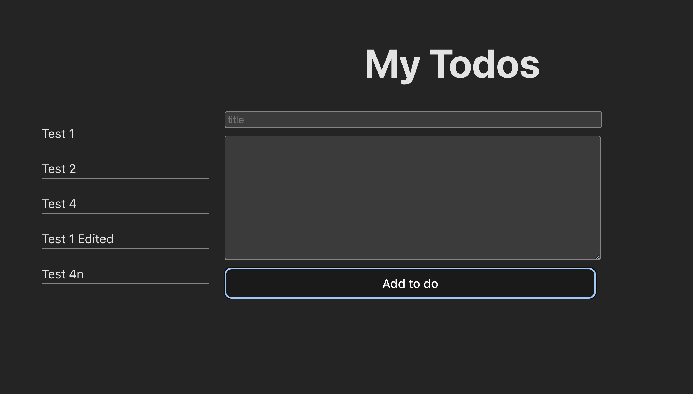

- Leet code challenge solution

  - Pascal's triangle II
  - refactored the code to account for the Big O
  - time and space complexity concepts were explained

- Todo List App :

  - Users can create to dos
  - Users can view the list of created to dos
  - Users can click into and view a single to do
  - Users can edit a specific todo
  - Users can delete a specific todo
  - The Lists are now stored in the persistent storage ( WEB local storage);
  - The data shown is now gotten from the persistent storage

  
